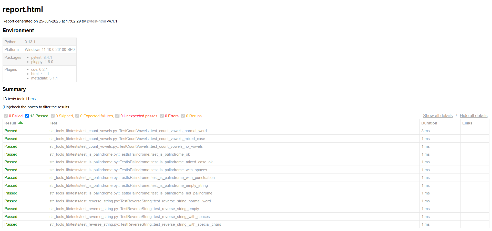

# Text Processing Library - Test Suite


Comprehensive test suite for a Python text processing library with pytest, featuring string reversal, vowel counting, and palindrome detection.

## Table of Contents
- [Features](#features)
- [Test output](#test-output)
- [Prerequisites](#prerequisites)
- [Installation](#installation)
- [Running Tests](#running-tests)
- [Generating Reports](#generating-reports)
- [Test structure](#test-structure)

## Features
- ✅ **Reverse String**: `reverse_string(s: str) -> str` (Python API usage)
- 🔢 **Count Vowels**: `count_vowels(s: str) -> int` (supports special characters)
- 🔄 **Palindrome Check**: `is_palindrome(s: str) -> bool` (case/space insensitive)
- 📊 **HTML Reporting**: Detailed test execution reports
- 🧪 **100% Test Coverage**: Edge cases included

## Test Output


## Prerequisites
- Python 3.6+
- pip package manager

## Installation
```bash
# Clone repository
git clone https://github.com/ivan-silvanovich-is/VK-internship-tester-automatization-2025.git
cd VK-internship-tester-automatization-2025

# Install dependencies
pip install -r requirements.txt
```

## Running Tests
```bash
# Run all tests with verbose output
pytest -v

# Run specific test module
pytest str_tools_lib/tests/test_is_palindrome.py -v

# Run with coverage report
pytest --cov=str_tools_lib
```

## Generating Reports
```bash
# Generate HTML report (saved as report.html)
pytest --html=report.html
```

## Test Structure
```text
tests/
├── test_reverse_string.py   # String reversal tests
├── test_count_vowels.py     # Vowel counting tests
└── test_is_palindrome.py    # Palindrome detection tests
```
Each test file contains:
- Test classes with descriptive method names
- Docstrings explaining test cases
- Edge case coverage (empty strings, special chars, mixed case)
